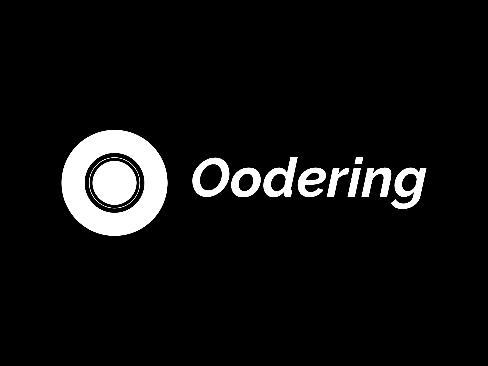

 

# Oodering -Restaurant Kiosk System

Oodering is a restaurant kiosk system designed to enhance the dining experience for both customers and restaurant owners. The system leverages React.js with Chakra UI for the client application and Spring Boot with Spring Web, Security, and Spring Cloud for the backend.PostgreSQL is used as the database.


## Table of Contents

- [Overview](#overview)
- [Features](#features)
- [Getting Started](#getting-started)
  - [Prerequisites](#prerequisites)
  - [Installation](#installation)  

## Overview

Oodering provides a comprehensive solution for restaurant management, including a Real-time Kitchen Dashboard, Order Processing System, Product Management, Inventory Management, Bill Management, Analytics, Supplier Management, and a Report Module. The system offers a user-friendly interface for customers to place orders seamlessly.

## Features

### 1. Real-time Kitchen Dashboard
- Enable kitchen operators to monitor orders and their status in real-time.

### 2. Order Processing System
- Streamline the order processing workflow for enhanced efficiency.

### 3. Product Management
- Easily manage and update the restaurant's product offerings.

### 4. Inventory Management
- Keep track of inventory levels and automatically update based on orders.

### 5. Bill Management
- Generate and manage bills efficiently.

### 6. Analytics
- Gain insights into sales, customer preferences, and other key metrics.

### 7. Supplier Management
- Manage relationships with suppliers and streamline the supply chain.

### 8. Report Module
- Generate comprehensive reports for various aspects of restaurant management.

### 9. Comprehensive User Interface
- Provide a user-friendly interface for customers to place orders easily.

## Getting Started

### Prerequisites

- Node.js and npm for the React.js client application.
- Java Development Kit (JDK) 18 for running the Spring Boot backend.
- PostgreSQL database.

### Installation

1. **Clone the Repository:**
   ```bash
   git clone https://github.com/Gayan-98/Oodering.git
